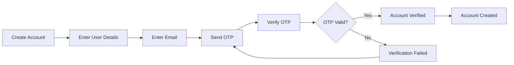
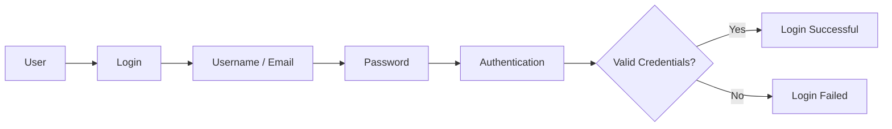
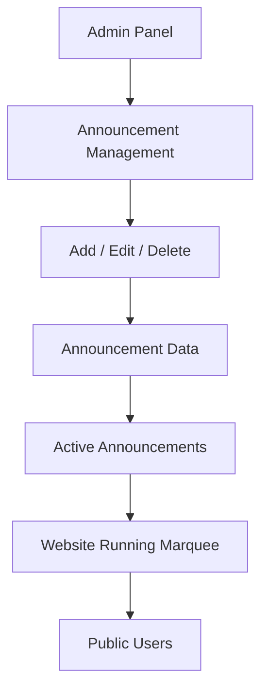
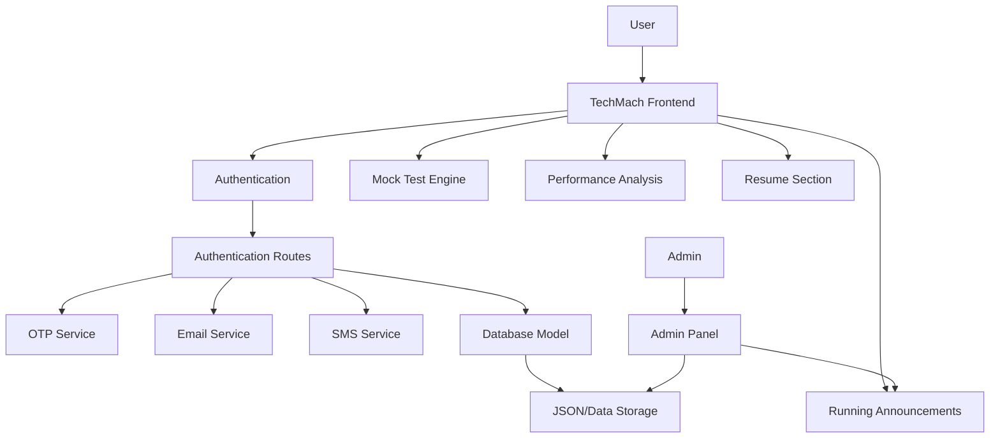

# 🚀 TechMach AI Mock Test Platform

> **Practice. Test Your Knowledge. Improve Your Score.**

**TechMach Technology** is a modern, interactive, and responsive web-based mock test platform designed for **Computer Science students, competitive exam aspirants, and technology learners**.

The platform provides a realistic online examination experience with timed assessments, negative marking, question navigation, performance analysis, answer review, authentication, OTP verification, Admin Panel controls, running announcements, and a growing set of technology-focused learning features.

---

## 🌐 About TechMach

TechMach is designed to bring **practice, assessment, performance analysis, and technology learning into one place**.

The platform focuses on providing an exam-like experience while keeping the interface simple, responsive, and user-friendly.

### 🎯 Core Vision

**Learn → Practice → Test → Analyze → Improve**

TechMach aims to help students:

* Practice regularly
* Experience realistic mock examinations
* Identify weak areas
* Track performance
* Improve accuracy and speed
* Prepare for competitive examinations
* Strengthen Computer Science fundamentals
* Prepare for technology and cybersecurity-related careers

---

# ✨ Key Features

## 📝 Advanced Mock Test System

* Multiple Computer Science mock tests
* Subject-wise tests
* Exam-wise tests
* STET-focused practice tests
* Timed examinations
* Negative marking support
* Question and option shuffling
* Question palette
* Previous/Next question navigation
* Mark questions for review
* Attempted/unattempted question tracking
* Automatic score calculation
* Accuracy calculation
* Performance summary
* Detailed answer review
* Best score tracking
* Average score tracking
* Progress/statistics storage

---

# 🔐 Authentication & Account System

TechMach includes an account and authentication system for managing registered users.

### Registration

Users can create an account using:

* Full Name
* Unique Username / User ID
* Email Address
* Password
* Confirm Password
* OTP verification

### OTP Verification

The authentication system supports OTP-based verification through dedicated service modules.



---

# 🔑 Login System

The platform provides a dedicated Login interface for registered users.

### Login Flow



The existing authentication functionality is integrated with the backend authentication routes and services.

---

# 👑 Admin Panel

TechMach includes a dedicated **Admin Panel** for administrative control.

The Admin Panel is separated from the normal user experience.

### Admin Capabilities

* Manage platform content
* Manage announcements
* Control running announcements
* Manage administrative data
* Access admin-specific functionality
* Maintain website-level configuration

The navigation includes dedicated:

* 🔐 Login
* 👑 Admin

controls.

---

# 📢 Admin-Controlled Running Announcements

The announcement system was upgraded so that announcements are **managed from the Admin Panel**, rather than being controlled from the Create Account modal.

### Admin can:

* ➕ Add announcements
* ✏️ Edit announcements
* 🗑️ Delete announcements
* 👁️ Enable/disable announcements
* 🔄 Manage announcement order

Only active announcements are displayed on the public website.

### Announcement Architecture



### Public Website

Users see the announcements through the website's running announcement interface.

The administrative management controls are **not displayed inside the Create Account modal**.

---

# 🛡️ Cybersecurity Visual Experience

A dedicated **Two-Factor Authentication cybersecurity visual/demo section** has been added to the website.

The section visually demonstrates the authentication journey:

```text
Password / Login
       ↓
Authentication
       ↓
Second-Factor
       ↓
OTP / Authenticator
       ↓
Verified
       ↓
Secure Access
```

### Visual Steps

1. 🔐 Password / Login
2. 🔑 Authentication
3. 🛡️ Second-Factor
4. 🔢 OTP / Authenticator
5. ✅ Verified
6. 🔒 Secure Access

The animation is presented as a **compact running cybersecurity visual** rather than taking up excessive screen space.

It is positioned above the **Build My Resume** section.

> **Note:** This visual is an educational cybersecurity demonstration and should not be confused with the actual authentication mechanism unless explicitly connected to the authentication backend.

---

# 📄 Build My Resume

TechMach also includes a dedicated **Build My Resume** section.

The feature is designed to provide users with a convenient way to work toward creating a professional resume.

The cybersecurity visual section is placed directly above this area to maintain a natural technology-focused flow.

---

# 📚 Available Test Categories

TechMach currently focuses on a wide range of Computer Science and technology subjects.

### Computer Science

* Computer Fundamentals
* Computer Networks & Security
* Database Management & SQL
* Programming & OOP
* Digital Logic & Microprocessors
* Data Structures & Algorithms
* Operating Systems
* Software Engineering
* Theory of Computation & Automata

### Emerging Technologies

* Artificial Intelligence
* Internet of Things (IoT)
* Robotics
* Cyber Security
* Cloud Computing

### Programming

* Python
* Java
* C / Programming fundamentals

### Competitive Exam Preparation

* Teaching Aptitude
* STET
* Subject-wise practice
* Competitive examination-oriented tests

---

# 📊 Performance Tracking

TechMach provides users with performance-oriented information after completing tests.

### Performance Metrics

* 🏆 Best Score
* 📈 Average Score
* 🎯 Accuracy
* ⏱️ Time Performance
* ✅ Correct Answers
* ❌ Incorrect Answers
* ⏭️ Unattempted Questions
* 🔍 Detailed Answer Review

This helps users understand their preparation level and identify areas requiring improvement.

---

# 🧭 Question Navigation System

The examination interface provides an interactive question navigation experience.

Users can:

* Move between questions
* Jump directly to a question
* Mark questions for review
* Identify attempted questions
* Identify unanswered questions
* Review answers before completing the test

This provides an experience closer to a real computer-based examination.

---

# 🔀 Question Randomization

To make repeated practice more effective, the platform supports:

* Question shuffling
* Option shuffling
* Dynamic question ordering

This reduces memorization based purely on question position and encourages genuine preparation.

---

# 📱 Responsive Design

TechMach is designed to work across different screen sizes.

### Supported Interfaces

* 💻 Desktop
* 💻 Laptop
* 📱 Mobile
* 📱 Tablet

The UI has been optimized for:

* Responsive layouts
* Flexible sections
* Mobile-friendly controls
* Responsive mock-test interface
* Compact cybersecurity animation
* Responsive Admin Panel components

---

# 🧩 Website UI Improvements

Several UI and UX improvements have been integrated into the platform.

### Header

The website header includes:

* TechMach branding
* Contact section
* Theme control
* 🔐 Login button
* 👑 Admin button

### Footer

The footer has been organized with clearer sections such as:

**Quick Links**

instead of the more generic **Navigation Links** terminology.

The footer also supports platform information and upcoming-content messaging.

---

# 📢 Live Running Announcement UI

The public website includes a floating:

**📢 Announcements**

control.

Active announcements can be displayed as a continuously running marquee.

Example:

> 📚 More Mock Tests & New Exams Coming Soon...! 🚀 | Everything in One Place | Stay Tuned 🚀

The announcement content is controlled from the Admin Panel.

---

# 🤖 Coming Soon

## AI Interview

An AI-powered interview simulator designed to help:

* Students
* Freshers
* Job seekers
* Technical candidates

practice technical and HR interview scenarios.

---

## 🧠 AI Assistant

An intelligent study assistant designed to help users:

* Understand questions
* Clarify concepts
* Learn difficult topics
* Improve preparation
* Get study-related assistance

> 🚧 **AI Interview & AI Assistant — Coming Soon**

---

# 🏗️ System Architecture

The current project follows a frontend + backend structure.



---

# 🔐 Security Architecture

Sensitive credentials are intentionally separated from the source code.

### Environment Variables

The project uses:

```text
.env
```

for sensitive configuration such as API credentials.

The `.env` file should **never be committed to GitHub**.

Instead, the repository contains:

```text
.env.example
```

which provides the required environment-variable structure without exposing actual secrets.

### Important Security Rules

```text
.env              → NEVER upload
node_modules/     → NEVER upload
.env.example      → Safe template
API Keys          → Environment variables
Passwords         → Never hardcode
```

---

# 📁 Project Structure

```text
TechMach/
│
├── data/
│   └── db.json
│
├── models/
│   └── db.js
│
├── routes/
│   └── authRoutes.js
│
├── services/
│   ├── emailService.js
│   ├── otpService.js
│   └── smsService.js
│
├── .env.example
│
├── index.html
├── server.js
│
├── package.json
├── package-lock.json
│
├── bpsc_math_data.js
│
├── about-right-photo.png
├── about-section-photo.png
├── about-techmach.png
├── hero-bg.png
├── og-image.png
├── og-image-orig.png
└── profile.jpg
```

---

# 🛠️ Tech Stack

## Frontend

* HTML5
* CSS3
* JavaScript
* Responsive Web Design
* Google Fonts
* LocalStorage

## Backend

* Node.js
* Express.js
* REST-style API routes
* Authentication services
* OTP services
* Email services
* SMS service integration

## Data

* JSON-based application data
* Database/model layer
* LocalStorage for selected client-side statistics and progress

## Development

* Git
* GitHub
* npm
* Environment variables
* `.env.example`

---

# 📦 Installation

Clone the repository and open the project directory.

Install the required dependencies:

```bash
npm install
```

---

# 🔐 Environment Configuration

Create a local `.env` file based on `.env.example`.

Example:

```env
PORT=5000

# Add your required API/service credentials here
# Never commit this file to GitHub
```

> Do not copy real API keys into the README.

---

# ▶️ Running the Project

Start the backend/server using the project's configured npm command.

For a typical Node.js setup:

```bash
npm start
```

If the project uses a development script:

```bash
npm run dev
```

Then open the configured local application URL in your browser.

---

# 🚀 Deployment

The project can be deployed using a suitable hosting platform.

### Important Deployment Requirements

Before deployment:

* Configure environment variables
* Never upload `.env`
* Install dependencies using `npm install`
* Verify backend API routes
* Verify authentication
* Verify OTP functionality
* Verify Admin Panel
* Verify announcement management
* Verify static assets
* Verify responsive layout

---

# 🔒 Secret Management

This project intentionally excludes:

```text
.env
node_modules/
```

from the GitHub repository.

### Why?

`.env` may contain:

* API keys
* Email credentials
* Database credentials
* Authentication secrets
* Service credentials

`node_modules` contains installed dependencies and can be regenerated using:

```bash
npm install
```

Therefore, neither should be committed to the repository.

---

# 🧪 Testing Checklist

Before publishing a new version, verify:

### Authentication

* [ ] Registration works
* [ ] Email validation works
* [ ] OTP generation works
* [ ] OTP verification works
* [ ] Login works
* [ ] Invalid credentials are rejected
* [ ] Admin authentication works

### Mock Tests

* [ ] Tests load correctly
* [ ] Timer works
* [ ] Negative marking works
* [ ] Question navigation works
* [ ] Question palette works
* [ ] Mark for review works
* [ ] Score calculation works
* [ ] Answer review works
* [ ] Performance statistics work

### Admin Panel

* [ ] Admin Panel opens correctly
* [ ] Announcement creation works
* [ ] Announcement editing works
* [ ] Announcement deletion works
* [ ] Active/inactive control works
* [ ] Website marquee updates correctly

### UI

* [ ] Desktop layout works
* [ ] Mobile layout works
* [ ] Login button works
* [ ] Admin button works
* [ ] Footer works
* [ ] Build My Resume section works
* [ ] 2FA visual works
* [ ] No unnecessary announcement controls appear in Create Account modal

---

# 📈 Future Roadmap

### Phase 1 — Completed / Integrated

* [x] Modern TechMach interface
* [x] Mock test engine
* [x] Subject-wise tests
* [x] Timed examinations
* [x] Negative marking
* [x] Question navigation
* [x] Performance tracking
* [x] Answer review
* [x] User registration
* [x] OTP verification
* [x] Login system
* [x] Admin Panel
* [x] Admin-controlled announcements
* [x] Running announcement UI
* [x] Responsive design
* [x] Cybersecurity 2FA visual
* [x] Build My Resume section
* [x] Improved footer/Quick Links
* [x] Environment-variable based secret management

### Phase 2 — Planned

* [ ] AI Interview
* [ ] AI Assistant
* [ ] Advanced performance analytics
* [ ] Personalized recommendations
* [ ] More competitive examinations
* [ ] More Computer Science test series

---

# 🎯 Project Goal

The ultimate goal of TechMach is to build a unified technology-learning and assessment platform where users can:

```text
        LEARN
          ↓
       PRACTICE
          ↓
         TEST
          ↓
       ANALYZE
          ↓
        IMPROVE
          ↓
       SUCCEED 🚀
```

TechMach aims to make exam preparation more structured, measurable, and accessible.

---

# 👨‍💻 Developer

## Priy Ranjan

**Developer & Creator of TechMach Technology**

Portfolio: `priyrk.vercel.app`

---

# ⭐ Support

If you find TechMach useful, consider giving the repository a ⭐ star.

Your support helps the project grow and motivates further development.

---

# 📜 License

This project is developed for educational, learning, and technology-platform purposes.

---

## 🚀 TechMach Technology

> **Learn. Practice. Test. Improve.**

**Everything in One Place.**
